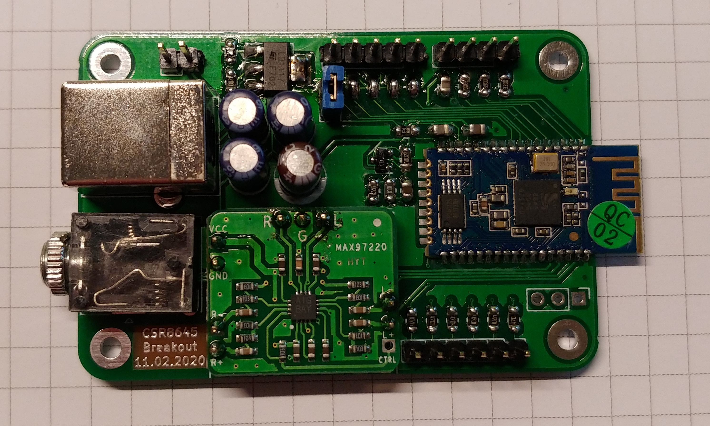

# CSR8645-bluetooth-receiver-board
Breakout board for F-3188 V2.0 bluetooth board with single ended output signal and onboard power supply.

This is a simple circuit board (43mm x 64mm) to make use of the features of the very common *F-3188 V2.0* which is based on the Qualcomm *CSR8645*. Simply connect power (5V via USB Type B or up to 15V via pin header) and 3.5mm phone connector to get an audio signal in aptX quality.

Pin headers can be used to connect status LEDs and control buttons. Many features can be customized by connecting a supported programmer.
A *MAX97220* board converts the differential ended signal from the *CSR8645* to a single ended signal. The onboard power supply uses a *LD1117 SC-R* to provide a stable input voltage (3.5-3.6V) for both mounted PCBs.

The output level is high enough to drive a dedicated amplifier. If the board is used to directly drive headphones it may be better to skip the onboard power supply and use 5V input voltage as input voltage for the *MAX97220*.
